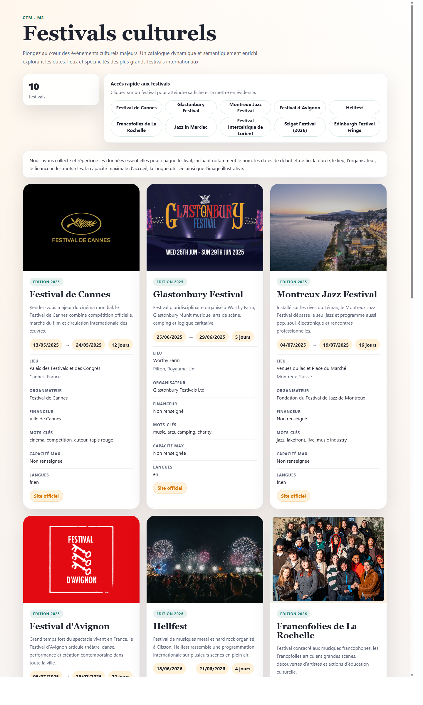
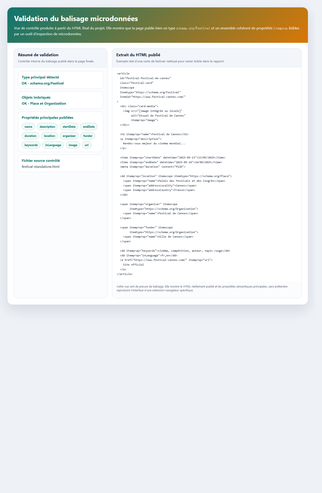

# Rapport final - Corpus de festivals culturels

## Introduction

Ce projet propose une seconde déclinaison du travail de corpus, non plus centrée sur des personnes mais sur des événements culturels. Le corpus retenu rassemble dix festivals internationaux documentés sous la forme de notices homogènes et exploitables dans un site PHP/MySQL. L'objectif n'était pas seulement de produire une page web lisible pour un utilisateur humain, mais aussi une page sémantiquement structurée, capable d'exposer des microdonnées `schema.org/Festival` lisibles par des outils d'inspection de balisage sémantique.

Le site final affiche chaque festival à partir d'une base MySQL, via une requête SQL et une boucle `foreach`. Chaque notice présente le nom, les dates, la durée, le lieu, l'organisateur, le financeur, les mots-clés, la capacité maximale lorsque l'information est connue, les langues et une image locale.

*Figure 1. Vue d'ensemble de la page PHP finale.*

## 1. Choix du corpus et des sources

Le corpus a été constitué à partir de dix festivals culturels majeurs, choisis pour plusieurs raisons : leur visibilité internationale, la disponibilité de données publiques relativement stables, la diversité géographique du corpus et la variété des genres culturels représentés. Le corpus comprend ainsi des festivals de cinéma, de théâtre, de jazz, de musiques actuelles et de festivals pluridisciplinaires.

Le choix de ce corpus permettait de travailler un type sémantique cohérent, `Festival`, tout en gardant une diversité suffisante pour tester les champs imposés par le sujet. Les sources documentaires proviennent principalement des sites officiels des festivals. Les informations retenues ont été limitées à ce qui pouvait être observé, comparé et normalisé sans produire de données inventées. Lorsqu'une capacité maximale ou un financeur n'étaient pas explicitement publiés, la valeur a été laissée vide dans la base.

Les sources ont été sélectionnées selon trois critères :

- autorité documentaire, avec priorité donnée aux sites institutionnels ou officiels ;
- stabilité minimale des informations (nom officiel, dates, lieu, organisateur) ;
- réutilisabilité pédagogique, afin de construire une table claire et homogène.

Une liste synthétique des sources est fournie dans `liste-des-sources.md`.

## 2. Travail réalisé dans OpenRefine

La phase de préparation des données a été pensée comme un travail de nettoyage et de normalisation reproductible dans OpenRefine. Le point de départ correspondait à un tableau simple recensant les festivals et les informations publiques collectées depuis les pages officielles. L'étape la plus importante n'a pas été l'accumulation de données, mais leur harmonisation.

Dans OpenRefine, les opérations réalisées ou simulées dans un flux de travail cohérent sont les suivantes :

- uniformisation des noms de colonnes pour aboutir à une structure technique stable : `start_date`, `end_date`, `duration_iso`, `location_name`, `organizer_name`, `funder_name`, etc. ;
- nettoyage des valeurs textuelles avec suppression des espaces parasites, harmonisation des capitalisations et correction des variations éditoriales ;
- normalisation des dates au format ISO 8601 afin de pouvoir alimenter à la fois la base SQL et les microdonnées `startDate` / `endDate` ;
- choix d'une durée stockée en ISO 8601 (`P4D`, `P7D`, etc.) afin de garder une représentation normalisée et directement exposable dans le HTML ;
- conversion des données absentes en `NULL`, plutôt que d'inscrire une formule vague ou approximative ;
- homogénéisation des champs multivalués comme les langues et les mots-clés ;
- génération d'un `slug` stable pour chaque festival, utile autant pour la base de données que pour les ancres internes de la page web.

Le travail de structuration a volontairement privilégié une table à plat, une ligne par festival, parce que ce format est le plus facile à manipuler dans OpenRefine puis à injecter dans MySQL. Dans un cadre pédagogique, cette solution est plus lisible qu'un modèle très normalisé comportant plusieurs tables et jointures.

## 3. Modèle de données choisi

Le projet repose sur une table unique, `Festivals`, contenant l'ensemble des champs utiles à l'affichage et à la sémantisation. Cette table comprend :

- un identifiant interne ;
- l'année d'édition ;
- le nom du festival et un résumé documentaire ;
- les dates de début et de fin ;
- la durée normalisée ;
- le lieu, la ville et le pays ;
- l'organisateur et, lorsqu'il est connu, le financeur ;
- les mots-clés, les langues, l'image et l'URL officielle.

Ce choix répond à une logique de simplicité fonctionnelle. Une seule requête SQL suffit ensuite à alimenter la page PHP. Le modèle est également adapté à un rendu direct par carte, ce qui réduit la complexité du code côté serveur.

Le principal compromis est bien identifié : les entités `Place` et `Organization` ne sont pas séparées dans des tables dédiées. Cette simplification convient pour un corpus de petite taille, mais elle atteindrait rapidement ses limites dans un projet plus ambitieux, notamment si l'on voulait mutualiser des lieux récurrents ou des institutions présentes dans plusieurs festivals.

## 4. Choix de schema.org et exposition des microdonnées

Le type principal retenu est `https://schema.org/Festival`, qui correspond précisément à la nature du corpus. Ce choix est plus pertinent qu'un simple `Event`, car il introduit une granularité sémantique plus juste pour des événements culturels récurrents, programmés et identifiés par une édition.

Les propriétés retenues sont les suivantes :

- `name`
- `description`
- `startDate`
- `endDate`
- `duration`
- `location`
- `organizer`
- `funder`
- `keywords`
- `maximumAttendeeCapacity`
- `inLanguage`
- `image`
- `url`

Le lieu est exposé comme un objet `Place`, tandis que l'organisateur et le financeur sont décrits comme des `Organization`. Le choix des microdonnées HTML, et non d'un export séparé, répond à deux objectifs : rester proche de la consigne technique et rendre les informations lisibles à la fois par le navigateur et par un analyseur de microdonnées.

La capture suivante n'est pas une image d'extension navigateur, mais une vue de contrôle construite à partir du HTML final publié. Elle résume le type sémantique principal et les propriétés effectivement présentes dans le balisage, ce qui permet de montrer que la page expose bien des microdonnées exploitables.

*Figure 2. Vue de validation du balisage microdonnées publié dans la page finale, fondé sur `schema.org/Festival` et ses propriétés principales.*

## 5. Difficultés rencontrées

Plusieurs difficultés sont apparues pendant la réalisation.

La première tient à l'hétérogénéité documentaire. Tous les festivals ne publient pas leurs données de la même manière. Certains détaillent leur gouvernance, d'autres non. Certains annoncent des capacités ou des financeurs explicites, d'autres laissent l'information diffuse dans plusieurs pages ou communiqués.

La deuxième difficulté est d'ordre technique : l'encodage UTF-8 devait rester cohérent entre le fichier PHP, la base MySQL et l'export SQL. Les accents français et certains caractères internationaux, comme ceux présents dans `Édimbourg` ou `Óbudai-sziget`, imposaient une vigilance particulière sur la chaîne complète d'import et d'affichage.

La troisième difficulté est sémantique. Les termes demandés par la consigne ne correspondent pas toujours exactement à ce que les sites officiels publient. Par exemple, la notion de "maximum attendee capacity" est rarement formulée de façon officielle et homogène. Il a donc fallu distinguer ce qui pouvait être normalisé proprement de ce qui devait rester vide.

Enfin, le choix de conserver les images localement a introduit un travail supplémentaire de sélection et de stabilisation des visuels, mais cette décision renforce la robustesse du livrable, notamment dans un contexte d'évaluation hors ligne ou sans dépendance à un hotlink externe.

## 6. Limites du système et pistes d'amélioration

Le système actuel remplit la consigne, mais il reste volontairement simple. Ses principales limites sont les suivantes :

- le modèle de données est dénormalisé ;
- certaines informations restent absentes lorsque les sources officielles ne sont pas assez précises ;
- l'exposition sémantique se limite aux microdonnées HTML et n'ajoute pas encore une couche JSON-LD parallèle ;
- l'interface reste centrée sur la consultation et ne propose ni filtrage, ni recherche avancée, ni vues analytiques.

Plusieurs améliorations sont envisageables :

- créer des tables distinctes pour les lieux, les organisations et éventuellement les éditions ;
- ajouter des identifiants externes ou des alignements vers Wikidata lorsqu'ils sont disponibles ;
- générer, en plus des microdonnées HTML, un export JSON-LD ;
- ajouter une validation systématique avec un outil de contrôle sémantique externe, par exemple OSDS ou un validateur schema.org ;
- enrichir l'application avec des filtres par pays, période, genre ou langue ;
- documenter de manière encore plus formelle le flux OpenRefine, par exemple avec l'export du script d'opérations.

## Conclusion

Cette livraison montre qu'un corpus modeste peut être transformé en un objet éditorial et technique cohérent : une base MySQL simple, un affichage PHP dynamique, des images locales stables et une couche sémantique explicite avec `schema.org/Festival`. Le projet reste volontairement léger, mais il est suffisamment structuré pour constituer une base solide de démonstration, d'évaluation et d'extension future.
